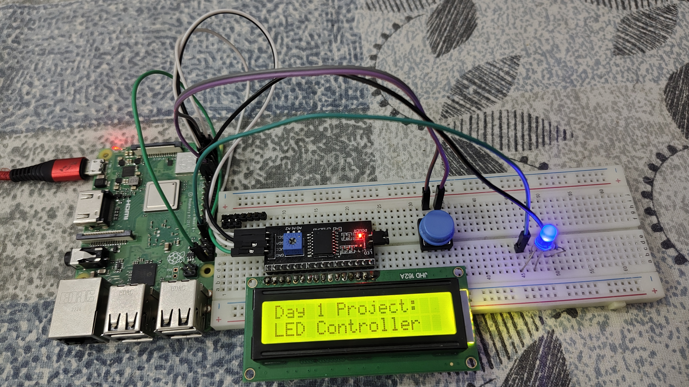

Day 1: Raspberry Pi – LED & LCD Controller

This is the first project in my “10 Days, 10 Projects” series using the Raspberry Pi.
The script allows a user to control an LED with a push button, cycling through four different modes:

🔴 OFF

🟢 ON

✨ Blinking

🌗 Fading (brightness control)

The current mode is displayed on a 16x2 I²C LCD screen.

🛠️ Hardware Required

Raspberry Pi (3B+ or similar)

1 × LED (any color)

1 × 330Ω Resistor (for the LED)

1 × Push Button

1 × 16x2 I²C LCD Display

Breadboard + Jumper Wires

⚙️ Setup and Installation
1. Enable I²C Interface

The LCD uses the I²C protocol. You need to enable it:

sudo raspi-config

Go to: 3 Interface Options → I5 I²C

Select Yes

Reboot if prompted

2. Install LCD Library

This project uses the RPLCD Python library.
On recent Raspberry Pi OS versions, install it with:

pip install RPLCD --break-system-packages

3. Check LCD Address

Find your LCD’s I²C address before running the script:

i2cdetect -y 1

You’ll see a value like 0x27 or 0x3F.
👉 Update the address variable in the Python script accordingly.

▶️ Running the Script

Navigate to the project directory and run:

python3 led_controller.py

The LCD will display a startup message

Press the push button to cycle through LED modes

Press CTRL + C to stop the program
