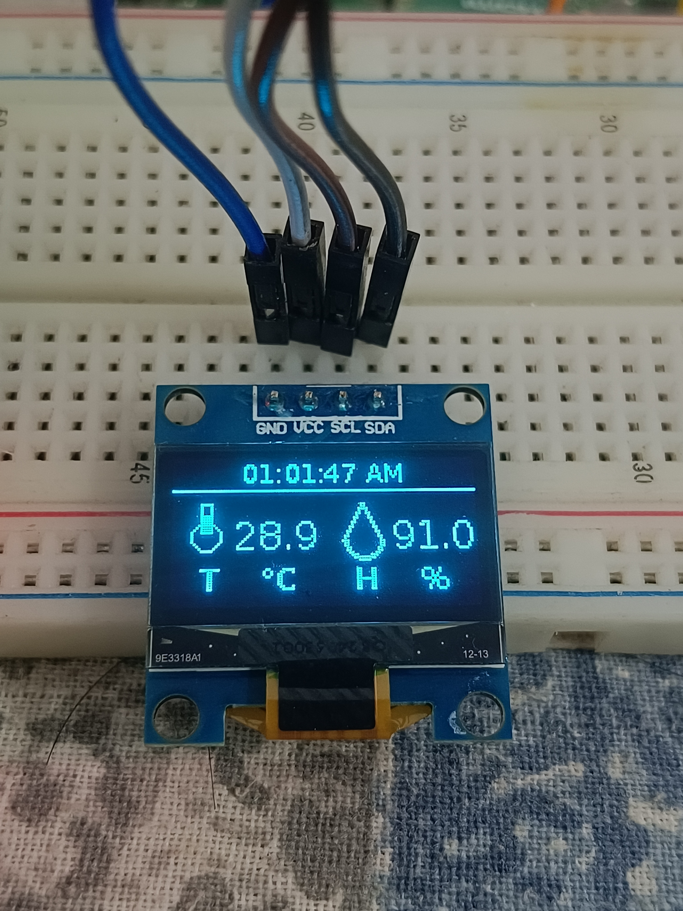
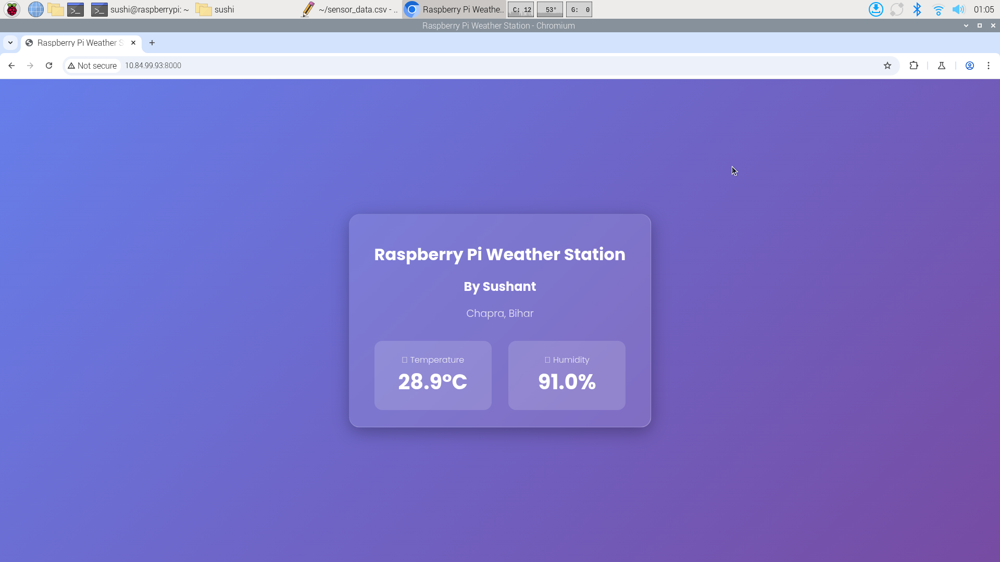
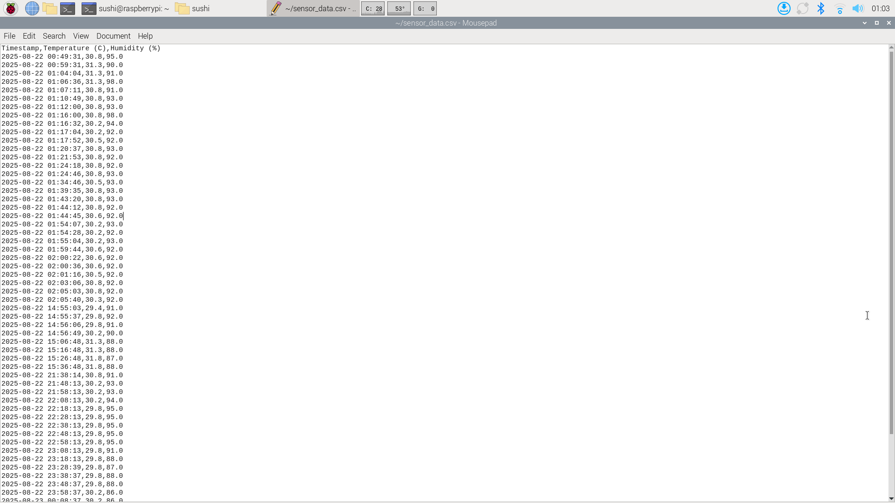

# 🌦️ Raspberry Pi Web-Enabled Weather Station  

A compact and feature-rich **weather station** built with a **Raspberry Pi**, **DHT11 sensor**, and **SSD1306 OLED display**.  
This project provides real-time temperature and humidity readings on a local display and through a stylish web interface, while also logging data to a CSV file for historical analysis.  



---

## ✨ Features  
- **Live OLED Display**: A crisp startup sequence and a clean interface showing the current time, temperature, and humidity.  
- **Modern Web Interface**: Access live readings from any device on your network through a beautifully designed, mobile-friendly web page.  
- **Automatic Data Logging**: Sensor data is automatically saved to a `sensor_data.csv` file every 10 minutes, with the first reading logged immediately on startup.  
- **Multi-threaded & Robust**: The application is built using Python's `threading` module, ensuring the web server, OLED display, and sensor readings run smoothly without interfering with each other.  
- **Easy to Set Up**: Minimal hardware and straightforward software installation.  

---

## 🛠️ Hardware Requirements  
- Raspberry Pi (any model with GPIO pins)  
- DHT11 Temperature and Humidity Sensor  
- SSD1306 128x64 I2C OLED Display  
- Breadboard and Jumper Wires  

---

## 🔌 Wiring Diagram  

| **Component Pin** | **Connects to Raspberry Pi Pin** |
|-------------------|----------------------------------|
| OLED VCC          | Pin 2 (5V)                       |
| OLED GND          | Pin 6 (Ground)                   |
| OLED SCL          | Pin 5 (GPIO3 / SCL)              |
| OLED SDA          | Pin 3 (GPIO2 / SDA)              |
| DHT11 VCC (+)     | Pin 1 (3.3V)                     |
| DHT11 GND (-)     | Pin 9 (Ground)                   |
| DHT11 DATA        | Pin 7 (GPIO4)                    |

---

## ⚙️ Software & Setup  

### Step 1: Prepare Your Raspberry Pi  
Ensure your Raspberry Pi is up-to-date:  
```bash
sudo apt-get update
sudo apt-get upgrade
```

### Step 2: Enable I2C Interface
The OLED display uses the I2C protocol.
```bash
sudo raspi-config
```
Navigate to:
``` bash
3 Interface Options → I5 I2C → <Yes>
```
Reboot if prompted.

### Step 3: Install Required Libraries
⚠️ On newer Raspberry Pi OS versions, you may need the --break-system-packages flag.

```bash
sudo pip3 install --break-system-packages adafruit-circuitpython-dht
sudo pip3 install --break-system-packages adafruit-circuitpython-ssd1306
sudo pip3 install --break-system-packages Pillow
sudo pip3 install --break-system-packages pytz
```
### 🚀 How to Run
Clone this repository or download the weather_station_web.py file to your Raspberry Pi.
Navigate to the file's directory in the terminal:
```bash
Copy
Edit
cd /path/to/your/project
```
Run the script:
```bash
python3 weather_station_web.py
```


### Accessing the Web Interface
Find your Raspberry Pi's IP address:
```bash
hostname -I
```
Then open any device on the same network and go to:
```bash
http://<YOUR_PI_IP>:8000
```


### 📊 Data Logging
The script automatically creates and appends data to a file named **sensor_data.csv** in the same directory.

**Frequency:** Data is logged every 10 minutes.

**First Entry:** The very first successful sensor reading is logged immediately upon starting the script.

**Format:** The CSV file contains three columns: Timestamp, Temperature (C), and Humidity (%).

**👤 Author
Sushant Sharma**
